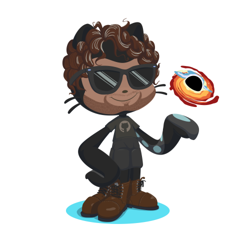

# Hi there 🐱‍🏍

Welcome to my github profile!!  
I'm a Computer engineer student and web developer from 
__Venezuela__, currently living in  __Argentina__.  

### Things I code with  

  
  
  
  
  
  
  
  
  
  
  
  
  
  
  

### Where to find me  

  
  
  
  
</p?
